<div align="center">

# 🚀 Mehmet Akyer — Uzay Temalı Portfolyo

**Kaydırdıkça uzayda bir yolculuğa çıkan, iki dilli (TR/EN) ve SEO odaklı kişisel portfolyo sitesi.**

### 🌐 [mehmetakyer.vercel.app](https://mehmetakyer.vercel.app/)

[](https://mehmetakyer.vercel.app/)
[](https://mehmetakyer.vercel.app/)

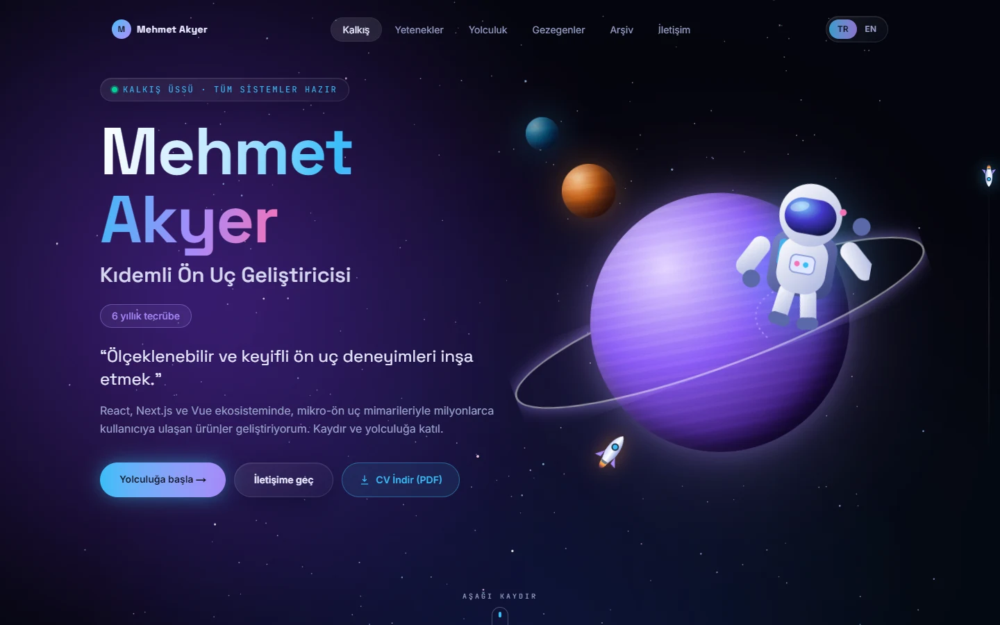

</div>

---

## İçindekiler

- [Ekran görüntüleri](#-ekran-görüntüleri)
- [Tech stack](#-tech-stack)
- [Nasıl yapıldı?](#-nasıl-yapıldı)
- [Proje yapısı](#-proje-yapısı)
- [Çalıştırma](#çalıştırma)
- [Metinleri güncelleme](#metinleri-güncelleme)
- [Vercel'e yayınlama](#vercele-yayınlama)

---

## 🖼 Ekran görüntüleri

Site, bir uzay gemisiyle ilerliyormuş hissi verecek şekilde kurgulandı. CV'deki her bölüm bir uzay metaforuyla eşleşiyor.

| Bölüm | Metafor | Görsel |
| --- | --- | --- |
| **Hero** | Kalkış üssü |  |
| **Yetenekler** | Takımyıldızları / galaksi haritası | 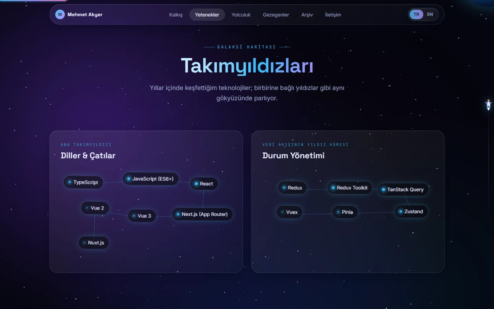 |
| **Yapay Zekâ Kullanımı** | Yeni keşfedilen sistem | 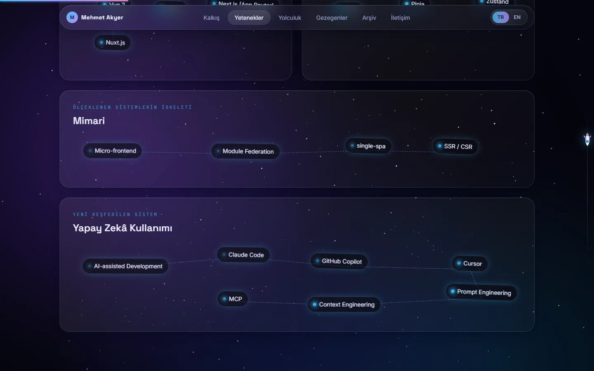 |
| **Deneyim** | Solucan delikleriyle zaman yolculuğu | 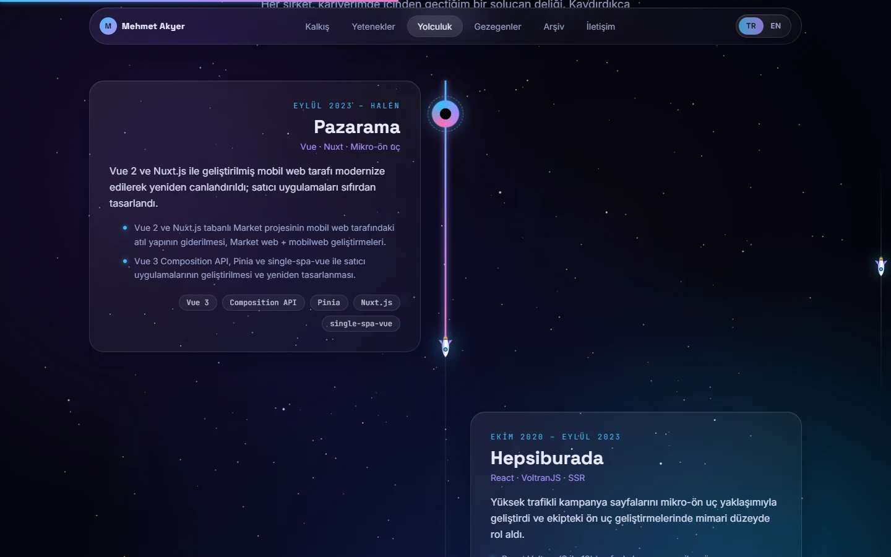 |
| **Projeler** | Keşfedilen gezegenler | 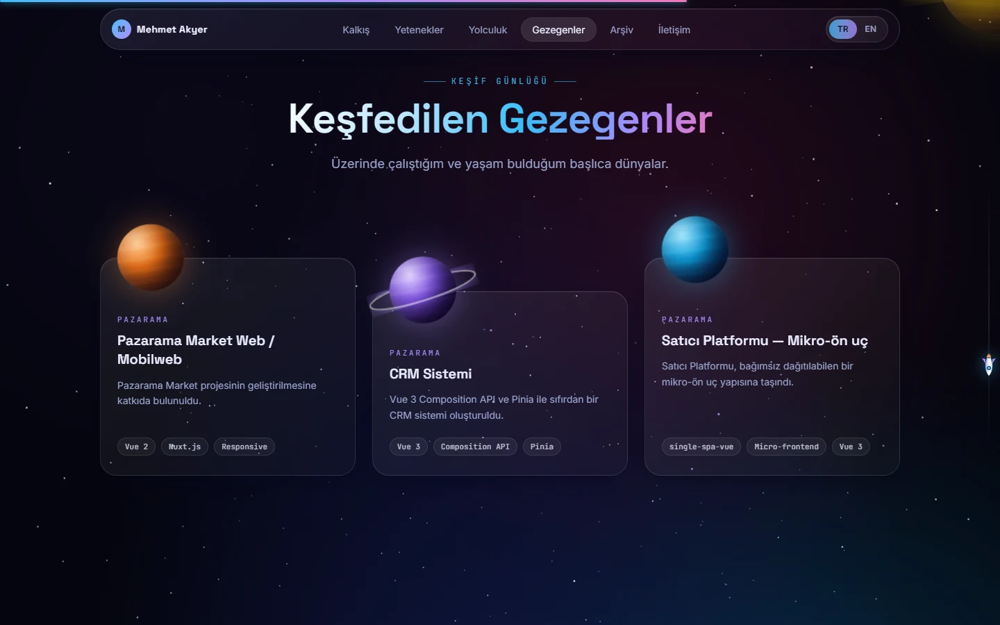 |
| **Eğitim & Sertifikalar** | Eski dünya kayıtları | 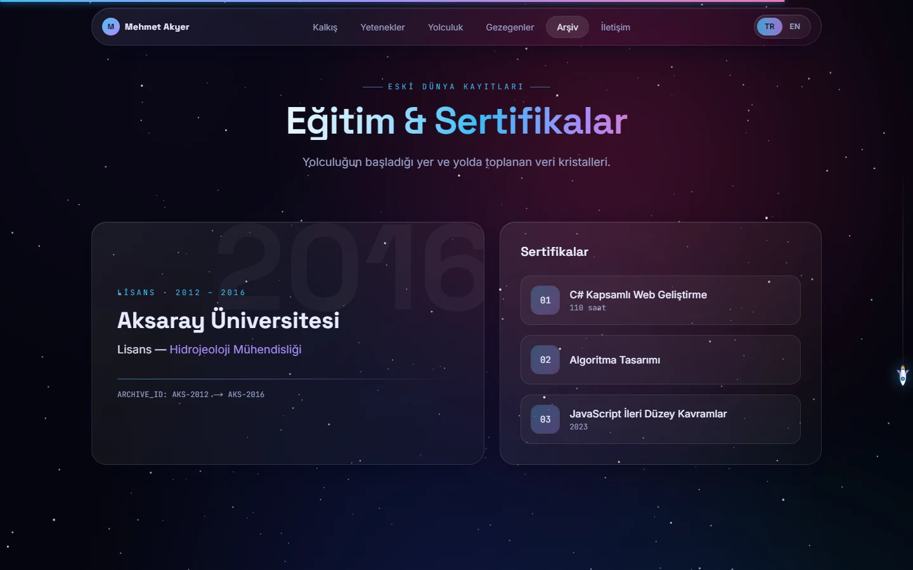 |
| **İletişim** | Sinyal gönder | 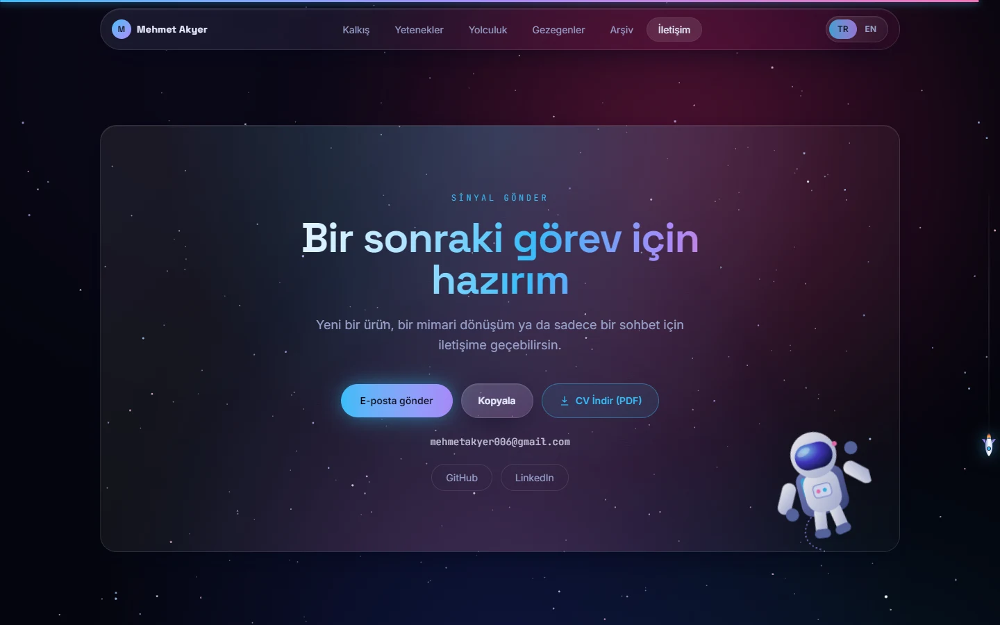 |

### 📱 Mobil

Tasarım mobil öncelikli. Küçük ekranda yıldız sayısı azalır, dekoratif gezegenler gizlenir, takımyıldızları esnek bir etiket düzenine dönüşür, menü cam efektli bir panele açılır.

<p align="center">
  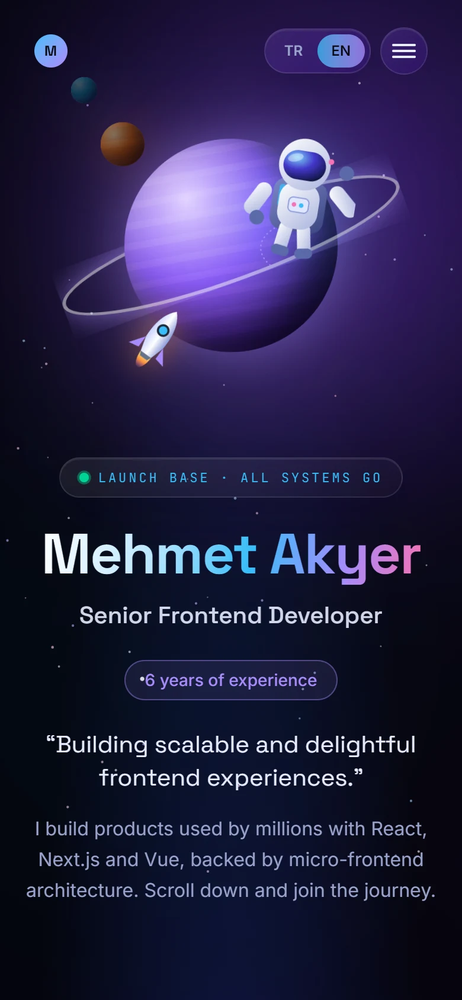
  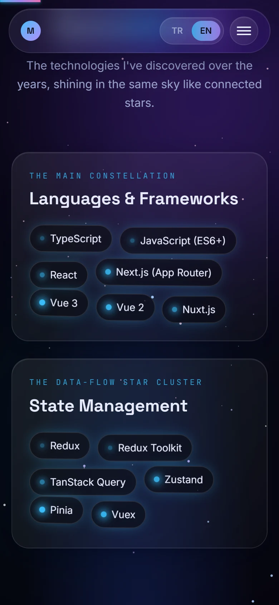
  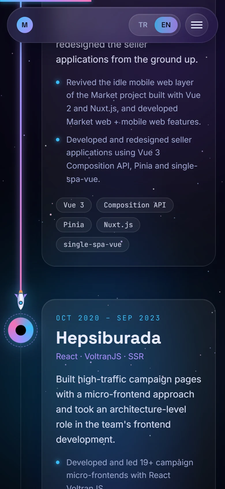
  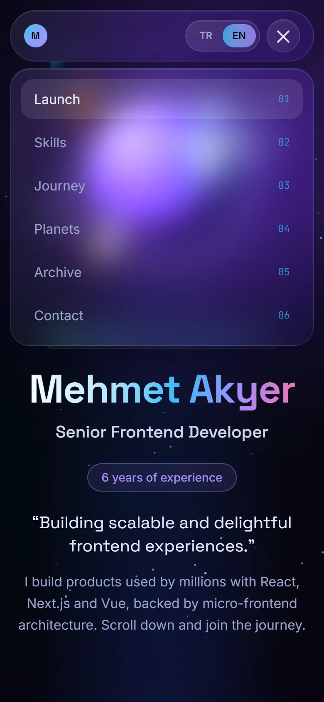
</p>

### 📄 İndirilebilir CV (PDF)

Her dil için ayrı bir CV, sitedeki içerikten **build sırasında otomatik üretilir** (`/tr/cv.pdf`, `/en/cv.pdf`). Metinler değiştiğinde CV de kendiliğinden güncellenir.

<p align="center">
  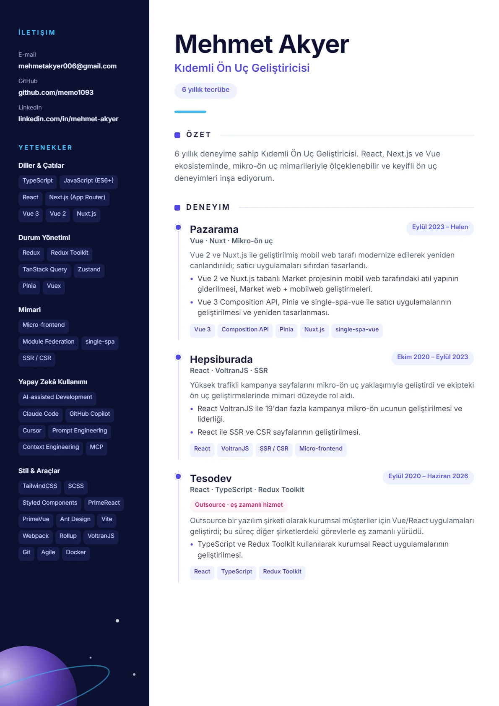
  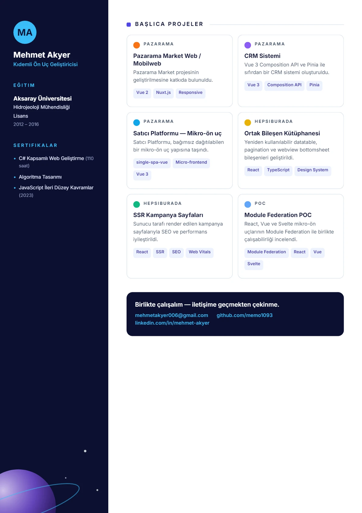
</p>

---

## 🧰 Tech stack

### Framework & Dil


### Stil & Animasyon


### Kütüphaneler

| Kütüphane | Ne için kullanıldı? |
| --- | --- |
|  | Scroll'a bağlı animasyonlar (`useScroll`, `useTransform`, `useSpring`), `whileInView` ile süzülerek giriş, menü geçişleri |
|  | İndirilebilir CV PDF'inin sunucu tarafında üretimi |
|  | Çeviri sözlüklerinin istemci paketine sızmasını build zamanında engeller |
|  | Inter, Space Grotesk ve JetBrains Mono'nun (`latin` + `latin-ext`) kendi sunucumuzdan servis edilmesi |
|  | Dil başına dinamik Open Graph paylaşım görseli |
|  | CV PDF'ine gömülen, Türkçe karakter destekli yazı tipi |

### SEO & Erişilebilirlik


### Araçlar & Yayın


---

## 🛠 Nasıl yapıldı?

### 1. Uzay yolculuğu hissi (scroll-driven)

Sayfa tek bir "yolculuk" olarak kurgulandı; üç katman birlikte çalışır:

- **`StarField`** — Sabit bir `<canvas>` üzerinde derinlikli (z-eksenli) yıldızlar çizilir. Kullanıcı kaydırdıkça yıldızların hızı artar ve noktalar çizgiye dönüşür; kaydırma durunca yıldızlar yavaşça sakinleşir. Yıldız sayısı ekran alanına göre ayarlanır (mobilde daha az), sekme arka plandayken `requestAnimationFrame` kendiliğinden durur.
- **`Nebula`** — Üç büyük, bulanık renk bulutu (mor, camgöbeği, magenta) `useScroll` ile birbirine karışır; sayfa ilerledikçe farklı bir "uzay bölgesine" geçilir. Yalnızca `opacity` ve `transform` değiştiği için GPU üzerinde ucuz çalışır.
- **`Parallax`** — Gezegenler ve astronot gibi dekoratif nesneler, ekrandan geçerken farklı hızlarda hareket ederek derinlik hissi verir.

```tsx
// components/ui/Parallax.tsx (özet)
const { scrollYProgress } = useScroll({ target: ref, offset: ["start end", "end start"] });
const y = useTransform(scrollYProgress, [0, 1], [distance, -distance]);
```

### 2. Cam efektli arayüz ve CSS gezegenleri

- **Glassmorphism:** `glass` yardımcı sınıfı (`backdrop-filter`, yarı saydam gradyan, ince kenarlık) Tailwind v4'ün `@utility` özelliğiyle tanımlandı. `GlassCard` ayrıca imleci takip eden bir ışık huzmesi çizer.
- **Gezegenler, astronot ve roket** harici görsel olmadan çizildi: gezegenler katmanlı CSS `radial-gradient` + `inset box-shadow`, halkalar iki yarıya bölünüp gezegenin önüne/arkasına yerleştirildi; astronot ve roket satır içi SVG.
- **Takımyıldızları:** `lib/constellation.ts` öğeleri ızgaraya yerleştirip deterministik olarak kaydırır (SSR/CSR farkı yaratmaz) ve ardışık yıldızları kesişmeyen çizgilerle birleştirir. Küçük ekranda aynı veriler normal bir etiket listesine döner.
- **Timeline:** Dikey yörünge çizgisi `scaleY` ile kaydırdıkça dolar, ucundaki roket aşağı iner; her durak bir "solucan deliği" düğümüyle işaretlenir ve kartlar sağdan/soldan süzülerek gelir.

### 3. İki dilli yapı (TR/EN)

- Her dil kendi URL'sinde yaşar: **`/tr`** ve **`/en`** (`app/[lang]`).
- **`proxy.ts`** (Next.js 16'da middleware'in yeni adı) `/` isteğini önce `NEXT_LOCALE` cookie'sine, sonra tarayıcının `Accept-Language` başlığına bakarak uygun dile yönlendirir.
- Metinler `dictionaries/tr.ts` ve `en.ts` içindeki **tip güvenli** sözlüklerde tutulur (`Dictionary` arayüzü sayesinde eksik bir çeviri derleme hatası verir). Sözlükler `server-only` ile yalnızca sunucuda çalışır, istemci paketine girmez.
- Dilden bağımsız veriler (linkler, teknoloji etiketleri) `data/profile.ts` içindedir.
- Dil değiştirici gerçek `<a>` bağlantılarıdır; arama motorları iki sürümü de ayrı ayrı tarayabilir.

### 4. SEO

| Konu | Uygulama |
| --- | --- |
| Başlık / açıklama | `generateMetadata` ile her dil için ayrı `title`, `description`, `keywords` |
| Çok dillilik | `canonical` + `hreflang` (`tr`, `en`, `x-default`) |
| Sosyal paylaşım | Open Graph + Twitter kartı; `opengraph-image.tsx` ile dil başına dinamik görsel |
| Yapısal veri | `Person` + `ProfilePage` + `WebSite` **JSON-LD** (`components/seo/JsonLd.tsx`) |
| Tarama | `app/sitemap.ts` (hreflang alternatifleriyle) ve `app/robots.ts` |
| İçerik | Sunucuda render edilen statik HTML, anlamlı başlık hiyerarşisi (`h1` → `h2`), `lang` özniteliği |
| Performans | `/tr` ve `/en` build sırasında statik üretilir; `next/font` ile layout kayması olmadan font yükleme |

### 5. İndirilebilir CV (PDF)

`app/[lang]/cv.pdf/route.tsx` bir route handler'dır; `generateStaticParams` sayesinde iki dil için PDF'ler **build sırasında** üretilir ve statik dosya gibi servis edilir. `lib/cv/CvDocument.tsx` sitedeki sözlük ve veri dosyalarını okuyarak iki sayfalık, modern bir CV düzeni çizer. Türkçe karakterler için Inter fontu PDF'e gömülür.

### 6. Erişilebilirlik ve dayanıklılık

- `prefers-reduced-motion` desteği: Framer Motion `MotionConfig reducedMotion="user"` + CSS düzeyinde animasyon kısıtlaması + yıldız alanının durağan çizimi.
- "İçeriğe geç" bağlantısı, klavye odak halkaları, `aria-current`/`aria-expanded`, dekoratif öğelerde `aria-hidden`.
- JavaScript kapalıysa `<noscript>` ile giriş animasyonları devre dışı kalır ve içerik görünür.
- Güvenlik başlıkları (`X-Content-Type-Options`, `X-Frame-Options`, `Referrer-Policy`, `Permissions-Policy`, HSTS) `next.config.ts` içinde tanımlıdır.

---

## 📁 Proje yapısı

```
app/
  [lang]/layout.tsx          Kök layout: fontlar, metadata, arka plan, navbar
  [lang]/page.tsx            Bölümleri birleştirir + JSON-LD
  [lang]/cv.pdf/route.tsx    Dil başına CV PDF'i (build sırasında üretilir)
  [lang]/opengraph-image.tsx Dil başına sosyal paylaşım görseli
  sitemap.ts · robots.ts · icon.svg · global-not-found.tsx
proxy.ts                     "/" → "/tr" | "/en" (cookie → Accept-Language → varsayılan)
dictionaries/                tr.ts, en.ts (tip güvenli çeviriler), types.ts
data/profile.ts              Dilden bağımsız CV verisi (linkler, teknoloji etiketleri)
assets/fonts/                CV PDF'ine gömülen Inter (OFL) yazı tipleri
components/
  background/                StarField (canvas warp), Nebula (scroll ile değişen nebula)
  layout/                    Navbar, LanguageSwitcher, ScrollProgress, Footer, Providers
  sections/                  Hero, Skills, Experience(+Timeline), Projects, Education, Contact
  ui/                        Reveal, Parallax, GlassCard, Planet, Astronaut, Rocket, CvDownload…
  seo/JsonLd.tsx             Schema.org Person + ProfilePage + WebSite
hooks/useActiveSection.ts    Scroll-spy
lib/                         i18n, site (URL'ler), constellation (yerleşim), cv/CvDocument
docs/screenshots/            README görselleri
```

---

## Çalıştırma

```bash
npm install
npm run dev      # http://localhost:3000  (Accept-Language'e göre /tr veya /en'e yönlenir)
npm run build && npm start
```

Yayına almadan önce `.env.example` dosyasını `.env.local` olarak kopyalayıp
`NEXT_PUBLIC_SITE_URL` değerini kendi alan adınla değiştir. Canonical, hreflang,
sitemap ve Open Graph URL'leri bu değerden üretilir.

## Metinleri güncelleme

- Metinler (TR/EN): `dictionaries/tr.ts` ve `dictionaries/en.ts`
- Linkler, e-posta, teknoloji etiketleri, yetenek listesi: `data/profile.ts`
- CV PDF'i bu iki kaynaktan otomatik üretilir; ayrıca bir şey yapmana gerek yok.

## Vercel'e yayınlama

1. Projeyi bir Git deposuna (GitHub/GitLab/Bitbucket) gönder.
2. [vercel.com/new](https://vercel.com/new) üzerinden depoyu içe aktar. Framework otomatik **Next.js** olarak algılanır;
   build/output ayarlarına dokunma.
3. **Settings → Environment Variables** altında ekle (Production):
   - `NEXT_PUBLIC_SITE_URL` = `https://mehmetakyer.vercel.app` (sonunda `/` olmadan)
4. Deploy et. Özel alan adı kullanacaksan **Settings → Domains**'ten ekle ve ardından
   `NEXT_PUBLIC_SITE_URL` değerini o alan adıyla güncelleyip yeniden deploy et.

Yayından sonra kontrol et:

- `/robots.txt` ve `/sitemap.xml` doğru alan adını gösteriyor mu?
- `/tr` ve `/en` canonical + hreflang etiketleri doğru mu? (sayfa kaynağında `rel="canonical"`)
- `/tr/cv.pdf` ve `/en/cv.pdf` indiriliyor mu?
- [Rich Results Test](https://search.google.com/test/rich-results) ile JSON-LD'yi doğrula,
  sitemap'i Google Search Console'a gönder.

> `NEXT_PUBLIC_SITE_URL` verilmezse Vercel'in `VERCEL_PROJECT_PRODUCTION_URL` değeri (`*.vercel.app`) kullanılır.

---

<div align="center">

Next.js, Tailwind CSS ve Framer Motion ile yapıldı · [mehmetakyer.vercel.app](https://mehmetakyer.vercel.app/)

</div>
